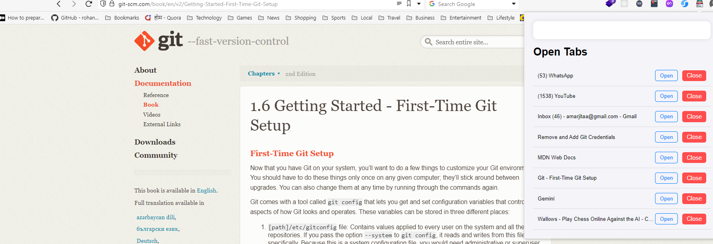

# Tab Reader Extension

## Description

The Tab Reader Extension is designed to enhance your browsing experience by providing a quick overview of all your open tabs. It allows you to see essential details such as the URL, title, and more, directly from the popup. This tool is perfect for managing multiple tabs and keeping track of your browsing session efficiently.

## Features

- **View All Tabs**: Displays a list of all currently open tabs with their titles and URLs.
- **Quick Navigation**: Click on a tab to navigate directly to it.
- **Close Tabs**: Easily close tabs from the popup.
- **Save and Restore**: Pending.

## Screenshots



## Installation

### Prerequisites

- Ensure you have Google Chrome or Chromium-based browser installed.

### Steps to Install

1. **Clone the Repository**:
   ```bash
   git clone https://github.com/your-username/tab-reader-extension.git
   cd tab-reader-extension
   ```
   
2. **Load the Extension**:

- Open Chrome and navigate to chrome://extensions/.
- Enable Developer Mode (toggle switch at the top-right).
-C lick on "Load unpacked" and select the tab-reader-extension directory.

3. **Verify Installation**:

You should see the Tab Reader Extension icon in your browser toolbar.

## Usage
1. Click the extension icon in your browser toolbar.
2. The popup will display a list of all open tabs with their titles and URLs.
3. Click on any tab title to navigate directly to that tab.
4. Use the close button next to each tab to close it directly from the popup.

## Contributing
We welcome contributions! Please follow these guidelines:

1. Fork the repository.
2. Create a new branch for your feature or bug fix.
3. Make your changes and commit them.
4. Push your branch to your forked repository.
5. Create a pull request with a detailed description of your changes.

## License
This project is licensed under the MIT License.

## Acknowledgements
- [Chrome Extensions Documentation](https://developer.chrome.com/docs/extensions)
- [Mozilla Developer Network](https://developer.mozilla.org/en-US/)

## Contact
For support or suggestions, please open an issue on GitHub or contact me at bob.coder.1982@gmail.com.